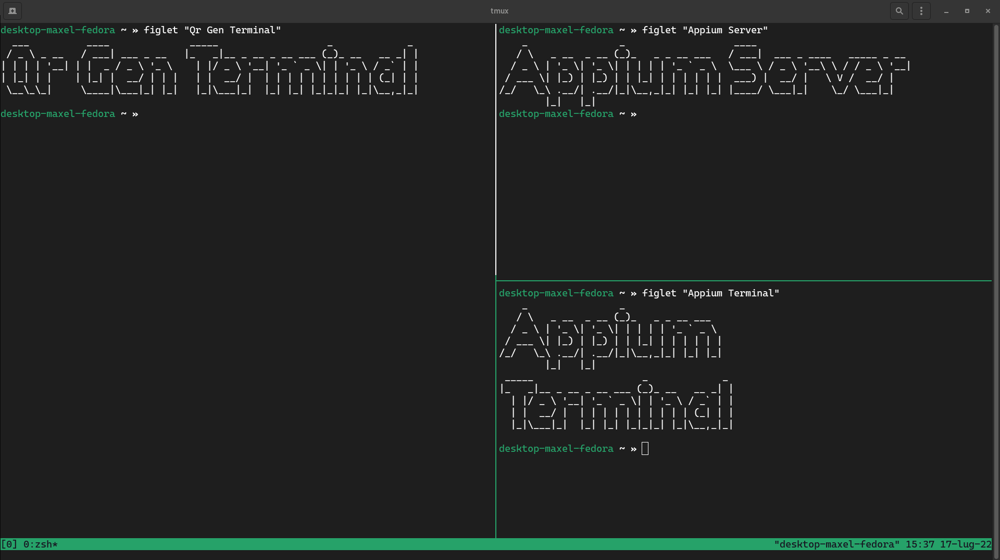
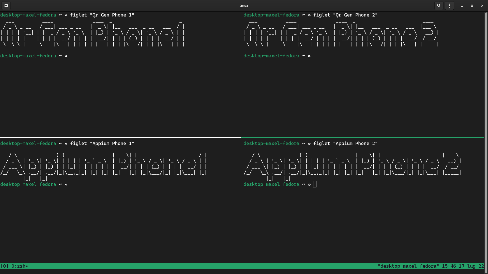

# Test-bench Setup & Execution

To replicate the test-bench, you need a PC with a monitor and a smartphone.

> **Tip:** In order to have everything under control in just one screen, we recommend to use `tmux`.

## Automated Execution

In this approach, you can use scripts to simplify the interactions with the tools provided by the toolkit. These scripts are collected in the `scripts` folder under the name `scripts/test-*`.

### Automated Single Execution

1. Move inside `scripts/test-single`
2. Open a terminal and configure `tmux` (or open multiple terminals) as shown in the image above (3 terminals).
3. In the left terminal, execute `./qrgen-terminal.sh -p left -a <app_name> -s <optional:start_position>`.
4. Position the smartphone so that the QR Code is fully framed by the camera.
5. In the top right terminal, execute `adb devices` and take note of `device ID`.
6. In the top right terminal, execute `appium` and take note of port.
7. In the bottom right terminal, execute `./appium-terminal.sh -p <appium_port> -d <device_id> -a <app_name> -s <optional:start_position>`

If something fails (e.g. xpath / object ID changes in the app), you will receive a prompt from the bottom right terminal to put the app in the scan page and then press any key to continue.

If the app crashes, the QRCodeFuzzer will try to recover the previous test by re-opening the app.

> Tests are saved inside `tools/QRCodeFuzzer/data-tests/<app_name>`

### Automated Parallel Execution

1. Move inside `scripts/test-single`
2. Open a terminal and configure `tmux` (or open multiple terminals) as shown in the image above (4 terminals).
3. In the top left terminal, execute `./qrgen-terminal.sh -p left -a <app_name> -s <optional:start_position>`.
4. In the top right terminal, execute `./qrgen-terminal.sh -p right -a <app_name> -s <optional:start_position>`.
5. Position the smartphones so that the QR Code is fully framed by the cameras (one on the left, one on the right).
6. In the bottom left (or right) terminal, execute `adb devices` and take note of `device ID` of both smartphones.
7. In another workspace, or in a background window, open two new terminals and execute `appium -p <port_number>`.
8. In the bottom left terminal, execute `./appium-terminal.sh -p <appium_port_1> -d <device_id_1> -a <app_name> -s <optional:start_position>`
9. In the bottom right terminal, execute `./appium-terminal.sh -p <appium_port_2> -d <device_id_2> -a <app_name> -s <optional:start_position>`

If something fails (e.g. xpath / object ID changes in the app), you will receive a prompt from the bottom terminals to put the app in the scan page and then press any key to continue.

If the app crashes, the QRCodeFuzzer will try to recover the previous test by re-opening the app.

> Tests are saved inside `tools/QRCodeFuzzer/data-tests/<app_name>`

### Automated Sequential Execution (experimental)

Sequential execution can be useful to execute multiple applications tests.
The setup is similar to single / parallel execution, with the only constraint that you can pass a `<app_lists_file>` instead of `<app_name>`.

Here's an example with parallel execution (single execution is straight forward):

1. Move inside `scripts/test-sequential`, and create two files `apps-phone-1.txt` and `apps-phone-2.txt`, each containing list of apps to test in new lines.
2. Open a terminal and configure `tmux` (or open multiple terminals) as shown in the image above (4 terminals).
3. In the top left terminal, execute `./qrgen-terminal.sh -p left -f <app_lists_file_1> -s <optional:start_position>`.
4. In the top right terminal, execute `./qrgen-terminal.sh -p right -f <app_lists_file_2> -s <optional:start_position>`.
5. Position the smartphones so that the QR Code is fully framed by the cameras (one on the left, one on the right).
6. In the bottom left (or right) terminal, execute `adb devices` and take note of `device ID` of both smartphones.
7. In another workspace, or in a background window, open two new terminals and execute `appium -p <port_number>`.
8. In the bottom left terminal, execute `./appium-terminal.sh -p <appium_port_1> -d <device_id_1> -f <app_lists_file_1> -s <optional:start_position>`
9. In the bottom right terminal, execute `./appium-terminal.sh -p <appium_port_2> -d <device_id_2> -f <app_lists_file_2> -s <optional:start_position>`

## Manual Execution

In this approach, you can directly employ each tool manually.

> **Tip:** Get the `udid` (`device_id`) using `adb devices`.

### Manual Single Execution

1. Start `appium -p 4723` in terminal (even in background)
2. Start a bash script with `python main.py -a <app> -j <json_data_path> -p <left/right/center> -sf <optional:start_position>` in another terminal
3. Start a bash script with `node index.js <app> <data_path> <port> <device_id> <optional:start_position>` in a third terminal

### Manual Parallel Execution

1. Start `appium -p 4723` in terminal A (even in background)
2. Start `appium -p 4724` in terminal B (even in background)
3. Start a bash script with `python main.py -a <app> -j <json_path>` for terminal 1
4. Start a bash script with `python main.py -a <app> -j <json_path>` for terminal 2
5. Start a bash script with `node index.js <app> <data_path> <port> <device_id>` for terminal 3 (same path as terminal 1)
6. Start a bash script with `node index.js <app> <data_path> <port> <device_id>` for terminal 4 (same path as terminal 2)

## Extra

### Telegram Notifier

The Telegram notifier can be used to get notified about app status changes.

You can find installation and usage instructions in [scripts/telegram-notifier](../scripts/telegram-notifier/README.md) folder.
